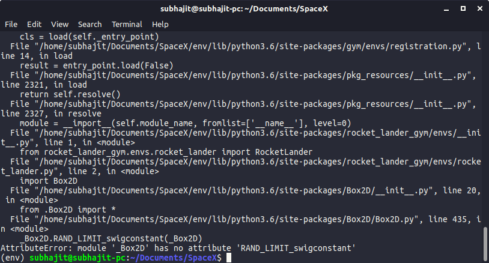
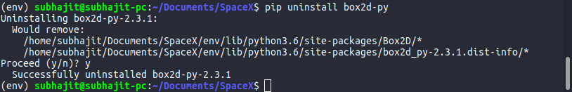

# Welcome to our FAQ section.
In this section I will give the solutions I found for some problems with installation of certain packages.
I am using [Ubuntu 18.04 LTS (Bionic Beaver)](http://releases.ubuntu.com/releases/18.04/)  as my OS.

## Problems with gym installation.
It's better if you do a full installation of [gym](https://github.com/openai/gym). More instructions for that [here](http://gym.openai.com/docs/#installation).

In this step you might get some errors with installation because of some missing packages. 

```
sudo apt-get install -y python-numpy cmake zlib1g-dev libjpeg-dev libboost-all-dev gcc libsdl2-dev wget unzip swig
```
use this command to install all packages. This should resolve all problems.


## How to use a Virtual Environment
I personally use [Virtualenv](https://github.com/pypa/virtualenv) because it's simple and effective to use.

Install it via

```
pip install virtualenv
```

I use Pyhton3 for all my projects. So creating an environment with python3 as default.
```
virtualenv -p python3 <envname>
```

It will create an environment. Now activate the environment with
```
source <envname>/bin/activate
```
and for deactivation
```
deactivate
```

In this environment you can perform all of your installations with pip.

## Box2d "RAND_LIMIT_swigconstant" Problem
I dont know why but this is a problem I face with Box2d. Nothing to worry solution is pretty easy.
 

You first need to uninstall Box2d.
```
pip uninstall box2d-py
```


Now execute the following commands.
```
git clone https://github.com/pybox2d/pybox2d
cd pybox2d/
python setup.py clean
python setup.py build
python setup.py install
```
This should resolve the problem.

##### Thank you. If there is any other problem then please open an issue I will try my best to find a solution and update FAQ section.
